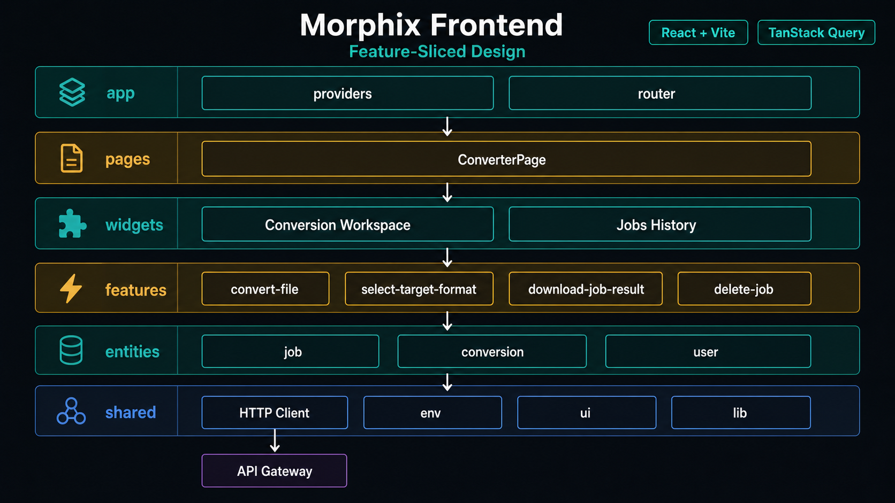
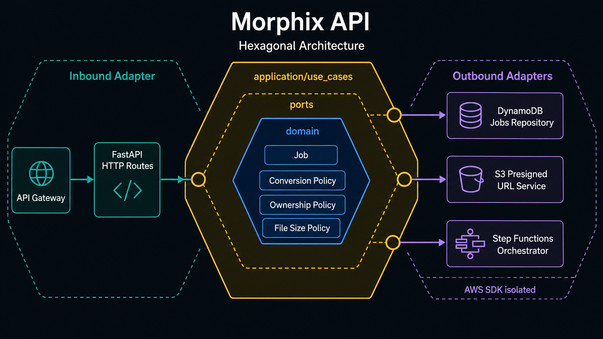
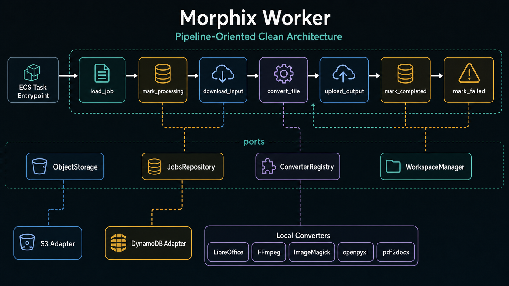
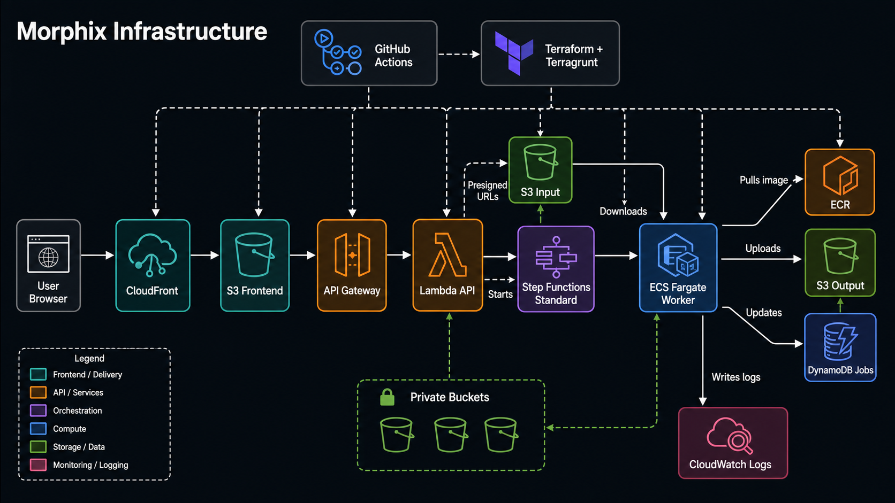

# Morphix

Morphix is a web application for asynchronous file conversion without external conversion APIs. The repository follows the PRD structure: React/Vite frontend, FastAPI API, Python conversion worker, Terraform/Terragrunt infrastructure, and GitHub Actions deployment workflows.

## Architecture

Morphix is split into four explicit architectural boundaries: the frontend owns the user workflow, the API owns job coordination and security, the worker owns conversion execution, and the infrastructure layer owns deployment, isolation, storage and observability.

### Frontend: Feature-Sliced Design



The frontend uses Feature-Sliced Design under `apps/frontend/src` so UI delivery can grow without turning shared code into a catch-all layer.

- `app`: application bootstrapping, providers, router and global styles.
- `pages`: route-level compositions such as the converter page.
- `widgets`: complete UI blocks such as the conversion workspace, conversion overview and jobs history.
- `features`: user actions with business intent, including file conversion, target-format selection, result download and job deletion.
- `entities`: domain-facing frontend models for jobs, conversions and user context.
- `shared`: HTTP client, environment config, hooks, UI primitives, utilities and shared types.

`TanStack Query` sits at the app/shared boundary for server state, caching and request lifecycle management. The browser never receives AWS credentials; it talks to the API through HTTP and uses presigned URLs when a file must move directly to or from S3.

### API: Hexagonal Architecture / Ports & Adapters



The API follows Hexagonal Architecture because FastAPI/API Gateway is only one inbound adapter, while DynamoDB, S3 and Step Functions are outbound adapters. The core application does not depend on FastAPI or AWS SDK details.

- `domain`: pure business concepts, value objects, policies and domain errors.
- `application/use_cases`: orchestration for creating jobs, listing jobs, requesting upload/download URLs, starting conversions and deleting jobs.
- `application/ports`: contracts required by use cases, such as job persistence, object URLs and conversion orchestration.
- `adapters/inbound/http`: FastAPI routes, schemas, dependency wiring and error mapping.
- `adapters/outbound`: concrete AWS implementations for DynamoDB, S3 presigned URLs and Step Functions.
- `core`: runtime configuration, security helpers and time utilities.

Dependency direction is kept inward: inbound adapters call use cases, use cases depend on ports, and outbound adapters implement those ports.

### Worker: Pipeline-Oriented Clean Architecture



The worker is organized around the actual conversion lifecycle: load job metadata, mark the job as processing, download the input, convert locally, upload the output and persist the final status. Failure handling is part of the pipeline rather than a side effect hidden in adapters.

- `entrypoints`: ECS/env input parsing and pipeline invocation.
- `application/pipeline`: step-by-step conversion orchestration and error flow.
- `application/ports`: object storage, job repository, converter registry, converter and workspace contracts.
- `domain`: conversion job, result, format, status, storage object and policies.
- `converters`: local conversion engines for LibreOffice, FFmpeg, ImageMagick, spreadsheets and PDF workflows.
- `adapters/outbound`: AWS-backed S3 and DynamoDB implementations.
- `core`: config, structured logging, temporary workspace management and safe subprocess execution.

The pipeline depends on ports, not on S3, DynamoDB, ECS or specific conversion binaries. That keeps conversion logic testable and lets infrastructure concerns stay at the edge.

### Infrastructure: AWS Runtime and Delivery



The infrastructure is provisioned with Terraform modules and Terragrunt live stacks. The runtime path is intentionally asynchronous: the frontend is delivered from S3 through CloudFront, the API receives job requests through API Gateway/Lambda, Step Functions coordinates the conversion workflow, and ECS Fargate runs the worker container.

- CloudFront and S3 deliver the React/Vite frontend.
- API Gateway invokes the FastAPI Lambda adapter.
- Private S3 buckets store input and output objects through short-lived presigned URLs.
- Step Functions starts and tracks conversion orchestration.
- ECS Fargate runs isolated worker tasks from ECR images.
- DynamoDB stores job metadata, ownership and status.
- CloudWatch captures logs and operational telemetry.
- GitHub Actions builds, tests and deploys frontend, API Lambda packages, worker images and infrastructure changes.

## Repository Layout

- `apps/frontend`: React + TypeScript + Vite conversion UI.
- `apps/api`: FastAPI Lambda service for jobs, presigned URLs, ownership checks and Step Functions starts.
- `apps/worker`: Dockerized Python worker using local conversion engines.
- `infra/blueprints`: reusable Terraform modules and remote-state bootstrap.
- `infra/terraform`: Terragrunt live stacks.
- `.github/workflows`: CI/CD for infra, frontend, API and worker.
- `docs/prd-coverage.md`: PRD requirement coverage checklist.

There is intentionally no `Taskfile.yml`, matching the MVP scope.

## Local Verification

```bash
npm install
npm run build
uv sync --all-packages --all-extras
uv run --group dev pytest
```

The API can run locally with fake AWS disabled only if AWS credentials and the required resources exist:

```bash
export PROJECT_NAME=morphix
export ENVIRONMENT=dev
export AWS_REGION=us-east-1
export JOBS_TABLE_NAME=morphix-dev-jobs
export INPUT_BUCKET=morphix-dev-input
export OUTPUT_BUCKET=morphix-dev-output
export STATE_MACHINE_ARN=arn:aws:states:us-east-1:123456789012:stateMachine:morphix-dev-conversion
uv run --group dev uvicorn morphix_api.main:app --reload
```

Python dependency management is handled with `uv`. Do not use manual `python -m venv` or direct `pip install` flows for backend development.

## MVP Limits

- Max upload size: configurable, default `100 MB`.
- Input retention: Terraform storage module default `1 day`.
- Output retention: Terraform storage module default `7 days`.
- Worker timeout: configurable, default `900 seconds`.
- Conversion engines are local binaries or Python libraries packaged in the worker image.

## Deploy

1. Configure `AWS_ACCESS_KEY_ID` and `AWS_SECRET_ACCESS_KEY` as repository secrets, and `AWS_REGION` as a repository variable.
2. Bootstrap Terraform state from `infra/blueprints/bootstrap`.
3. Run `.github/workflows/infra-lifecycle.yml` with `plan` or `apply`.
4. Deploy API, worker and frontend via their dedicated workflows. The API Lambda is packaged with `apps/api/scripts/build_lambda.sh`; the worker remains a Docker/ECR image because it runs on ECS Fargate.

The Terraform modules use private S3 buckets, short-lived presigned URLs, DynamoDB TTL, CloudWatch logs, Step Functions retries/catches, ECS Fargate isolation, and separated state boundaries.
