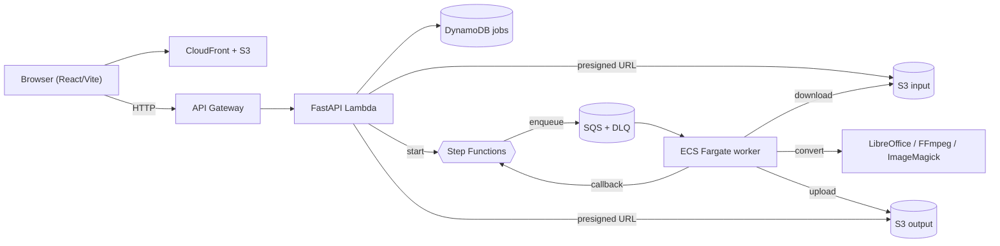
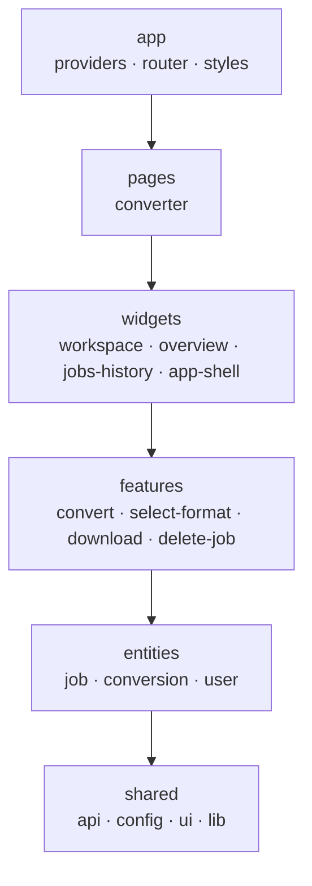
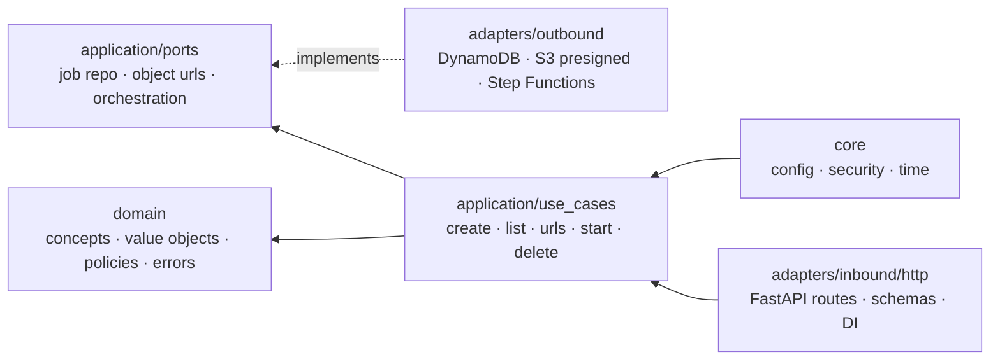
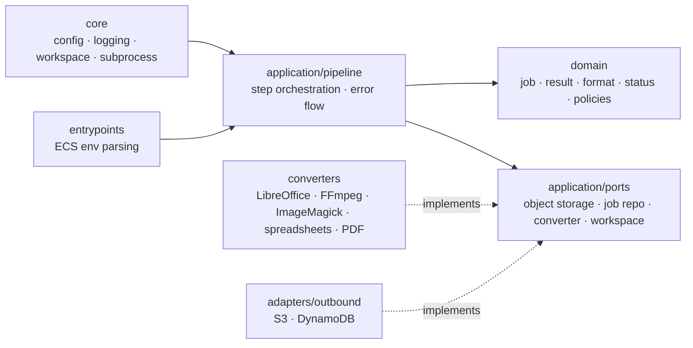

[English](README.md) | [Español](README.es.md)

# Morphix

Web app for asynchronous file conversion without external conversion APIs. React/Vite frontend, FastAPI API, Python conversion worker, Terraform/Terragrunt infrastructure, and GitHub Actions deployments.

## Architecture

Four explicit boundaries: frontend owns the user workflow, API owns job coordination and security, worker owns conversion execution, infrastructure owns deployment, isolation, storage and observability.



The runtime path is asynchronous: the frontend is delivered from S3 through CloudFront, the API receives job requests through API Gateway/Lambda, Step Functions orchestrates each conversion, SQS buffers worker execution, and one ECS Fargate worker consumes the queue sequentially. The browser never receives AWS credentials; it reads `runtime-config.json` published by Terraform to discover the API base URL and uses presigned URLs to move files directly to/from S3.

### Frontend — Feature-Sliced Design

`apps/frontend/src` (React 19 + Vite + Tailwind v4 + shadcn/ui, server state via TanStack Query):



- `app`: bootstrapping, providers, router, global styles.
- `pages`: route-level compositions.
- `widgets`: complete UI blocks (conversion workspace, overview, jobs history).
- `features`: user actions with business intent (convert file, select target format, download result, delete job).
- `entities`: domain-facing frontend models (jobs, conversions, user context).
- `shared`: HTTP client, env config, hooks, UI primitives, utilities, types.

### API — Hexagonal Architecture

`apps/api/src/morphix_api` (FastAPI). Inbound adapters call use cases, use cases depend on ports, outbound adapters implement those ports. The core never depends on FastAPI or AWS SDK details.



### Worker — Pipeline-Oriented Clean Architecture

`apps/worker/src/morphix_worker` (Python on ECS Fargate). The conversion lifecycle is an explicit pipeline: load job → mark processing → download input → convert → upload output → persist status. Failure handling is part of the pipeline, not hidden in adapters.



The pipeline depends on ports, not on S3, DynamoDB, ECS or specific binaries — keeping conversion logic testable and infrastructure concerns at the edge.

### Infrastructure — AWS Runtime and Delivery

Provisioned with Terraform modules (`infra/blueprints/modules`) and Terragrunt live stacks (`infra/terraform`). GitHub Actions builds, tests and deploys frontend, API Lambda packages, worker images and infrastructure changes.

- CloudFront + S3 deliver the frontend.
- API Gateway invokes the FastAPI Lambda adapter.
- Private S3 buckets store input/output via short-lived presigned URLs.
- Step Functions owns orchestration, status transitions and worker callbacks.
- SQS buffers jobs, retries pickup failures, moves poison messages to a DLQ.
- ECS Fargate runs the worker from ECR (`desired_count = 1`).
- DynamoDB stores job metadata, ownership and status.
- CloudWatch captures logs and telemetry.
- Frontend runtime variables are not injected by workflows; Terraform publishes them as S3 runtime config.

## Repository Layout

- `apps/frontend`: Bun-managed React + TypeScript + Vite conversion UI.
- `apps/api`: FastAPI Lambda service for jobs, batches, presigned URLs, ownership checks and Step Functions starts.
- `apps/worker`: Dockerized Python worker using local conversion engines.
- `infra/blueprints`: reusable Terraform modules and remote-state bootstrap. The state machine lives in the API module and publishes work to the shared conversion queue.
- `infra/terraform`: Terragrunt live stacks.
- `.github/workflows`: CI/CD for infra, frontend and backend. API and worker deploy from one ordered backend workflow.
- `docs/prd-coverage.md`: PRD requirement coverage checklist.

No `Taskfile.yml` by design, matching MVP scope.

## Local Verification

```bash
bun install --frozen-lockfile
bun run build
uv sync --all-packages --all-extras
uv run --group dev pytest
```

### Full stack on Docker Compose

The whole system (frontend, API, worker, DynamoDB, S3, SQS, DynamoDB Streams, realtime WebSocket) runs locally with `docker compose up --build`. Step Functions is bypassed by a `LocalSQSConversionOrchestrator` that enqueues directly to LocalStack SQS, and the realtime WebSocket bridge is implemented by an in-process FastAPI endpoint plus a DynamoDB Streams poller — no prod adapter behavior changes when the local-only env vars are unset.

```bash
docker compose up --build
```

Services:

| Service      | Port | Notes                                                                |
|--------------|------|----------------------------------------------------------------------|
| `frontend`   | 5173 | Vite dev server with HMR. Runtime config synthesized at start.       |
| `api`        | 8000 | FastAPI on uvicorn (`--reload`). Includes `/ws` WebSocket endpoint.  |
| `worker`     | -    | `queue_worker` polling LocalStack SQS. Source mounted read-only.     |
| `localstack` | 4566 | Emulates DynamoDB, S3, SQS, DynamoDB Streams.                        |
| `init`       | -    | One-shot, provisions tables/buckets/queues/DLQ before api + worker.  |

The init container exits as soon as provisioning is done; api and worker only start after it completes successfully. Hot-reload works for the API (uvicorn reload) and the frontend (Vite HMR). Worker source is bind-mounted, so Python edits apply after `docker compose restart worker`.

Local-only env toggles (transparent no-ops when unset in prod): `ORCHESTRATION_MODE`, `LOCAL_REALTIME`, `AWS_ENDPOINT_URL`, `S3_BROWSER_URL_BASE`.

API local run requires AWS credentials and resources:

```bash
export PROJECT_NAME=morphix
export ENVIRONMENT=dev
export AWS_REGION=us-east-1
export JOBS_TABLE_NAME=morphix-dev-jobs
export INPUT_BUCKET=morphix-dev-input
export OUTPUT_BUCKET=morphix-dev-output
export STATE_MACHINE_ARN=arn:aws:states:us-east-1:123456789012:stateMachine:morphix-dev-conversion
uv run --group dev uvicorn morphix_api.main:app --reload
```

Python deps are managed with `uv`. Do not use manual `python -m venv` or direct `pip install` for backend work.

## MVP Limits

- Max upload size: configurable, default `100 MB`.
- Input retention: `1 day`. Output retention: `7 days`.
- Worker timeout: configurable, default `900 seconds`.
- Conversion engines are local binaries or Python libraries packaged in the worker image.

## Deploy

1. Configure `AWS_ACCESS_KEY_ID` and `AWS_SECRET_ACCESS_KEY` as repository secrets. `AWS_REGION` is fixed in workflows as `us-east-1`.
2. Run `.github/workflows/infra-lifecycle.yml` with `plan` or `apply`. Bootstraps the Terraform state bucket and DynamoDB lock table if missing. Destroy flows stop running conversions and empty project buckets/ECR images before Terragrunt destroys stacks.
3. Deploy backend through `.github/workflows/backend-deploy.yml`, selecting `api`, `worker` or `both`. On push, it detects path changes and deploys only the affected components. The API Lambda is packaged with `apps/api/scripts/build_lambda.sh` (function zip + dependencies zip as a Lambda Layer); the worker is a Docker/ECR image for ECS Fargate.

Terraform modules use private S3 buckets, short-lived presigned URLs, DynamoDB TTL, CloudWatch logs, Step Functions callbacks, SQS redrive policies, ECS Fargate isolation, and separated state boundaries.
