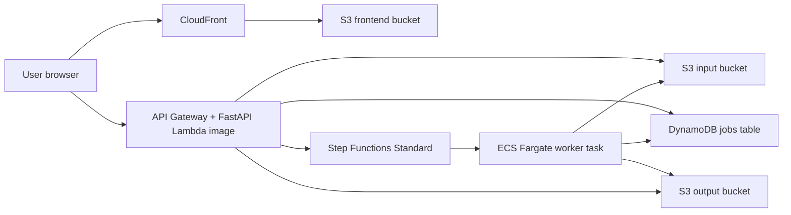

# Morphix

Morphix is a web application for asynchronous file conversion without external conversion APIs. The repository follows the PRD structure: React/Vite frontend, FastAPI API, Python conversion worker, Terraform/Terragrunt infrastructure, and GitHub Actions deployment workflows.

## Architecture



## Repository Layout

- `apps/frontend`: React + TypeScript + Vite conversion UI.
- `apps/api`: FastAPI service for jobs, presigned URLs, ownership checks and Step Functions starts.
- `apps/worker`: Dockerized Python worker using local conversion engines.
- `infra/blueprints`: reusable Terraform modules and remote-state bootstrap.
- `infra/terraform`: Terragrunt live stacks.
- `.github/workflows`: CI/CD for infra, frontend, API and worker.
- `docs/prd-coverage.md`: PRD requirement coverage checklist.

There is intentionally no `Taskfile.yml`, matching the MVP scope.

## Local Verification

```bash
npm install
npm run build
python3.11 -m venv .venv
source .venv/bin/activate
pip install -e apps/api[dev] -e apps/worker[dev]
npm run test:python
```

The API can run locally with fake AWS disabled only if AWS credentials and the required resources exist:

```bash
export PROJECT_NAME=morphix
export ENVIRONMENT=dev
export AWS_REGION=us-east-1
export JOBS_TABLE_NAME=morphix-dev-jobs
export INPUT_BUCKET=morphix-dev-input
export OUTPUT_BUCKET=morphix-dev-output
export STATE_MACHINE_ARN=arn:aws:states:us-east-1:123456789012:stateMachine:morphix-dev-conversion
uvicorn morphix_api.main:app --reload
```

## MVP Limits

- Max upload size: configurable, default `100 MB`.
- Input retention: Terraform storage module default `1 day`.
- Output retention: Terraform storage module default `7 days`.
- Worker timeout: configurable, default `900 seconds`.
- Conversion engines are local binaries or Python libraries packaged in the worker image.

## Deploy

1. Configure GitHub OIDC and AWS role ARN as repository variables/secrets used by workflows.
2. Bootstrap Terraform state from `infra/blueprints/bootstrap`.
3. Run `.github/workflows/infra-lifecycle.yml` with `plan` or `apply`.
4. Deploy API, worker and frontend via their dedicated workflows.

The Terraform modules use private S3 buckets, short-lived presigned URLs, DynamoDB TTL, CloudWatch logs, Step Functions retries/catches, ECS Fargate isolation, and separated state boundaries.

